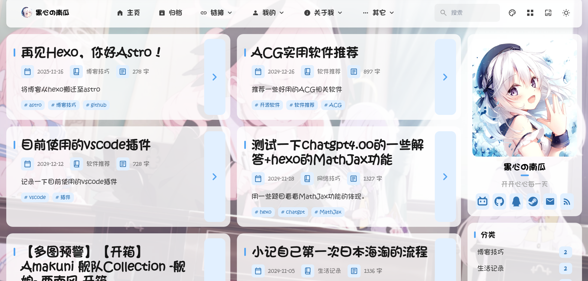

# 🌸 Mizuki  


[](https://opensource.org/licenses/MIT)



## 🚀 Quick Start

### 📦 Installation

1. **Clone the repository:**

   ```bash
   git clone https://github.com/matsuzaka-yuki/mizuki.git
   cd mizuki
   ```

2. **Install dependencies:**

   ```bash
   # Install pnpm if not already installed
   npm install -g pnpm
   
   # Install project dependencies
   pnpm install
   ```

3. **Configure your blog:**
   - Edit `src/config.ts` to customize blog settings
   - Update site information, theme colors, banner images, and social links
   - Configure feature page functionality

4. **Start the development server:**

   ```bash
   pnpm dev
   ```

   Your blog will be available at `http://localhost:4321`

### 📝 Content Management

- **Create new posts:** `pnpm new-post <filename>`
- **Edit posts:** Modify files in `src/content/posts/`
- **Customize special pages:** Edit files in `src/content/spec/`
- **Add images:** Place images in `src/assets/` or `public/`

### 🚀 Deployment

Deploy your blog to any static hosting platform:

- **Vercel:** Connect your GitHub repository to Vercel
- **Netlify:** Deploy directly from GitHub
- **GitHub Pages:** Use the included GitHub Actions workflow
- **Cloudflare Pages:** Connect your repository

- **Environment Variable Configuration (Optional):** Configure in `.env` file or deployment platform

```bash
# Umami API key for accessing Umami analytics data
# If Umami is enabled in config.ts, it's recommended to configure the API key here
UMAMI_API_KEY=your_umami_api_key_here
# bcrypt salt rounds (10-14 recommended, default 12)
BCRYPT_SALT_ROUNDS=12
```

Before deployment, update the `siteURL` in `src/config.ts`.
**Not recommended** to commit the `.env` file to Git. The `.env` file should only be used for local debugging or building. For cloud platform deployment, it's recommended to configure via the platform's `environment variables` settings.

## 📝 Post Frontmatter Format

```yaml
---
title: My First Blog Post
published: 2023-09-09
description: This is the first post of my new blog.
image: ./cover.jpg
tags: [tag1, tag2]
category: Frontend
draft: false
pinned: false
lang: en      # Only set when article language differs from site language in config.ts
---

⭐ If you find this project helpful, please consider giving it a star!
